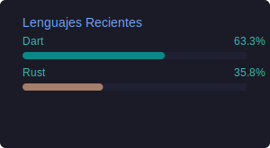
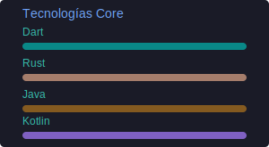

<div align="center">
  
# ¡Bienvenido al Universo de [JhonaCode](https://jhonacode.com) 🚀

[](https://jhonacode.com)
[](https://linkedin.com/in/jhonatanortiz)
[](https://twitter.com/jhonacode)
[](mailto:jhonacodes@gmail.com)
[](https://discord.gg/tu-server)
</div>


## 👨‍💻 Sobre Mí

```typescript
const JhonaCode = {
  role: "Software Engineer & Mobile Developer",
  code: ["Dart", "Kotlin", "Java", "Rust"],
  technologies: {
    mobile: ["Flutter", "Android Native", "Jetpack Compose"],
    backend: ["Rust", "Actix", "Diesel"],
    database: ["SQL", "NoSQL"],
    tools: ["Git", "Docker", "Android Studio", "Rust Rover"]
  },
  currentFocus: "Creando soluciones multiplataforma innovadoras",
  funFact: "No puedo dormir hasta entender cómo funciona algo por dentro"
};
```

## 🛠️ Tecnologías Principales

<div align="center">


</div>

## 📊 Análisis de GitHub

<div align="center">
  
</div>

## 💻 Distribución de Lenguajes

<div align="center">
  
  
</div>

## 🌟 Proyectos Destacados

<div align="center">
  <a href="https://github.com/JhonaCodes/multiselect_field">
    
  </a>
  <a href="https://github.com/JhonaCodes/reactive_notifier">
    
  </a>
</div>


<div align="center">

### 👥 Visitas al Perfil


</div>
